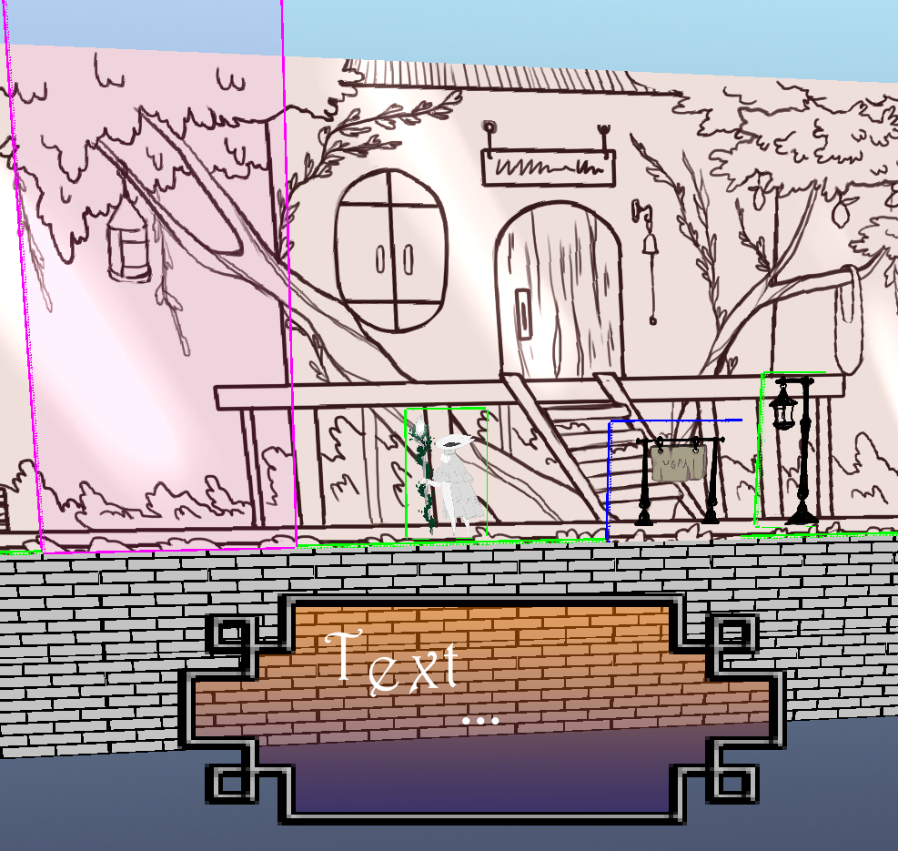

# BitFireEngine

## Info
### Dependeny
    This Engine usees another project "PXUltima".
    This is a library that contains all kinds of basic utility.
  
Link to git repository: https://github.com/BitPaw/PXUltima

## Images
### Test-Project: Cleaved

### Test-Project: Dust

# Trivia
## Q&A

|Question|My Answer|
|:-|:-|
| A new Engine?  Why do you even bother?  There are enough of them already. |  Yes.. I know..  There are so many of them and all of their ups and downs. |
| Why don't you use GameMaker, Unity or Unreal?   | I've used Unity a lot and will use it again sometime. Sadly, Unity is very frustrating to use. Even tho it exists for so long, it's lacking in so many regions.  It has a lot of features, jet it still feels like everything is a BETA Version and requires hours of work just to figure out how it works. Then I learn quickly, that this feature is too limited, then I have to spend more time re-doing it another way.  Why shouldn't I just do it correctly the first time?   My Point here is: Big Engines have poorly developed base features. You are required to make your own stuff. Small Engines on the other hand don't even have them or they are also poorly developed, for other reasons of course. |
| What is it then, that makes your Engine better than others? | I'll write this Engine as powerful as I can and it shall be very lightweight. It shouldn't be another clone of Unity or something alike. I want to create something very straight forward, something everyone can use and most importantly, to not hinder someone to take 100% advantage of every ounce of Hardware-Juice there is. |
| How do you think you will accomplish 'doing better' then professionals?  Sure they'll know what they do! | They know what they do, of course.   BUT.. if you take a look and go through Code-Histoy, you'll find that there are a lot of highly skilled people who are gods in their field but write horrible code. HR-People who will push you to solve solutions as fast as possible no matter the quality. Even good coders, they may write code with slight structural mistakes that scale horrible.  I'll go through hell and back to create everything myself. I need to plan a lot and had to rewrite the whole system several times already. I am learning here too! If I manage to combine everything under one library, that is well-performing and error prove, this Engine will be legendary.. maybe. |
| WHAT?!  Did you mean, you write everything yourself?  Even libraries  that are used time and time again? | YES! Exactly!   It is in a way stupid, a waste of time. BUT as I said, I have my reasons.  Did you ever see some of those 'well established' libraries? Hahaha...  They are the worst spaghetti-coding-clusterfucks I've seen i some time. They work.. yes. Are they understandable? Maybe. But does that mean good? Or even fast or slow? Hard to tell. |
| If you do 'everything' what do you have in mind? | Well.. 'everything' sure is a very vague. I mean by that, that i will add support for all sorts of formats. From music and video to images and models, maybe even more? So that you could juggle with all types, no matter common or uncommon, why not every type? We have time enough, don't we? |
| Sounds like a lot of work | It's a lot of work.. Yes... : ^) It's hard to stay motivated. |
| Do you have someone to help you? | Not really, a one man army.  I do have a lot of 'sometime i'll do something' helpers tho.. heh.. |
